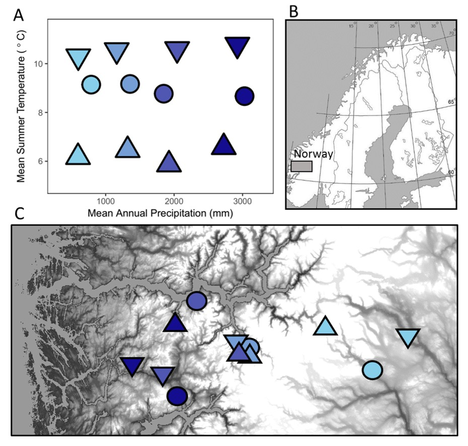

\begin{center}
\bigskip
\bigskip
{\Huge Tables and Figures}
\end{center}

\pagebreak

```{r setup, include = FALSE}

knitr::opts_chunk$set(echo = FALSE, warning = FALSE, message = FALSE)

```


```{r assemble data, include = FALSE}

# set wd
wd <- 'C:\\Users\\John\\Documents\\michigan\\seedclim\\'
setwd(wd)

# load packages
source("MS_Transients\\custom_functions_transients.R")
loadpax(pkg = c('grid','knitr','vegan','MASS','lme4','tidyverse','gridExtra','kableExtra'))

# load abundance data
x <- read.csv("data\\transitions.csv", stringsAsFactors = FALSE)
x <- filter(x, sp != 'Bot.lun')

# load site metadata
site.meta <- read.csv("data\\site_meta.csv", stringsAsFactors = FALSE)

# Load species 'dictionary'.
dict <- read.csv("data processing\\SpeciesCodeDictionary.csv", stringsAsFactors = FALSE)

#Load trait data
trait.data <- read.csv(file = 'data\\transients_traits.csv', stringsAsFactors = FALSE)

  
######

# seed bank data was sampled at a greater area than seedling and seed rain data... so...
# here I randomly subsample the seed bank data (without replacement) down to the fraction (based on area)
# equal to what it should be
frac <- (4 * 0.25^2) / (0.64^2)
tmp <- x %>% filter(stage == 'bank')
subsampled_bank <- tmp[0, ]

set.seed(7)
for (i in unique(tmp$site)) {
  tmp0 <- filter(tmp, site == i)
  tmp0 <- tmp0[rep(c(1:nrow(tmp0)), times = tmp0$abun), ]
  tmp0 <- tmp0[sample(c(1:nrow(tmp0)), size = round(nrow(tmp0) * frac)), ]
  tmp0$abun <- 1
  subsampled_bank <- rbind(subsampled_bank, tmp0)
}
  
subsampled_bank <- subsampled_bank %>%
  group_by(site, stage, sp, id) %>%
  summarise(abun = sum(abun))

x <- rbind(as.data.frame(filter(x, stage != 'bank')), 
           as.data.frame(subsampled_bank))

# Create a version of data where seed rain and seed bank are merged into one 'seed' category
xS <- x %>%
  mutate(stage = ifelse(stage %in% c('rain','bank'), 'seed', stage)) %>%
  group_by(site, stage, sp, id) %>%
  summarise(abun = sum(abun)) %>%
  ungroup()

# create versions with and without unidentified 'sp' individuals
# i do this now because it is easy to forget later...
# and in some cases I want to know the total density of seedlings
x_sp <- x
x <- filter(x, sp != 'sp')
xS_sp <- xS
xS <- filter(xS, sp != 'sp')

# default ggplot theme for later use
th <- theme_bw() + 
  theme(
    panel.grid.minor = element_blank(),
    panel.grid.major = element_blank(),
    panel.background = element_blank()) 

# calculate putative climate origins
if (FALSE) {
  x_origins <- add_origins(x)
  xS_origins <- add_origins(xS)
  write.csv(x_origins, "data\\transitions_origins.csv", row.names = FALSE)
  write.csv(xS_origins, "data\\transitions_seed_origins.csv", row.names = FALSE)
}

x_origins <- read.csv("data\\transitions_origins.csv", stringsAsFactors = FALSE)
xS_origins <- read.csv("data\\transitions_seed_origins.csv", stringsAsFactors = FALSE)

```




**Figure 1.** Panel A shows mean summer temperature and mean annual precipitation values at the twelve sites. Summer is defined as the warmest three months at each site. Panels B and C show site locations in southern Norway.

\pagebreak

```{r Seed origins, fig.width = 7, fig.height = 4}

# individuals and species status bar plot
tmp <- x %>%
  filter(stage != 'mature') %>%
  mutate(stage = stage_labels(stage)) %>%
  group_by(stage, id) %>%
  summarise(abun = sum(abun)) %>%
  group_by(stage) %>%
  mutate(
    abun_total = sum(abun),
    abun_label = round(100 * sum(abun[id == 'Transient']) / sum(abun)),
    abun_label = paste0(abun_label, '%'),
    id = factor(id, levels = c('Transient','Persistent'))) %>%
  ungroup() %>%
  arrange(desc(id)) %>%
  mutate(group = ifelse(stage %in% c('Seed rain', 'Seed bank'), 'Seeds', 'Seedlings'),
         group = factor(group, levels = c('Seeds','Seedlings'), labels = c('Seeds','Seedlings')))

fig2 <- ggplot(tmp, aes(x = stage, y = abun, fill = id, group = stage)) + 
    geom_bar(stat = 'identity', color = 'black') +
    geom_bar(aes(y = abun*1.1), stat = 'identity', alpha = 0) +
    geom_label(aes(label = abun_label, y = abun_total), vjust = -0.3, show.legend = FALSE) +
    labs(x = '', y = 'Individuals recorded') +
    scale_fill_manual(values = c('grey70','grey90'), name = 'Species status') +
  theme_bw() +
  theme(
    panel.grid.minor = element_blank(),
    panel.grid.major = element_blank(),
    panel.background = element_blank()) +
  facet_wrap(~group, scales = 'free')

fig2

```

**Figure 2.** Numbers of individuals recorded in this study, grouped by life stage and shaded by local species status. "Persistent" species occured as adults in two or more annual vegetation surveys, whereas "transient" seeds did not. Percentages are of transient species out of total life stage.

\pagebreak

```{r individuals vs temp, fig.height = 4, fig.width = 7}

j <- x %>%
  filter(stage %in% c('rain','bank')) %>%
  mutate(den = abun / (4 * 0.25^2)) %>%
  group_by(stage, site) %>%
  summarise(
    abun_tran = sum(den[id == 'Transient']),
    abun_per = 100 * abun_tran / sum(den),
    rich_tran = length(unique(sp[id == 'Transient'])),
    rich_per = 100 * rich_tran / length(unique(sp))
  ) %>%
  gather(var, val, -stage, -site) %>%
  left_join(site.meta[, c('site','temp','precip','temp.level','precip.level')], by = 'site') %>%
  ungroup() %>%
  mutate(
    MST = factor(c(6,9,10.5)[match(temp.level, c(1:3))]),
    MAP = factor(c(650,1300,2000,2900)[match(precip.level, c(1:4))]),
    stage = stage_labels(stage))

st <- j %>%
  group_by(stage, var) %>%
  do(mod = summary(lm(val ~ temp, data = .))$coef) %>%
  mutate(pval = mod[[2,4]])

j$pval <- st$pval[match(paste(j$stage, j$var), paste(st$stage, st$var))]
j$pval_line <- ifelse(j$pval < 0.1, j$val, NA)
j$pval_line_lty <- factor(ifelse(j$pval < 0.05, 1, 2))

#somtime may need to uselabeller = "label_parsed" to fix superscript

tmp <- j %>%
  filter(stage %in% c('Seed rain','Seed bank')) %>%
  mutate(var = factor(var, levels = c("abun_tran","abun_per","rich_tran","rich_per"),
              labels = c("# Transient seeds / m^2",
                         "% Transient seeds\nof site total",
                         "# Transient species",
                         "% Transient species\nof site total")))

j1 <- filter(tmp, var %in% c("# Transient seeds / m^2", "% Transient seeds\nof site total"))
  
p1 <- ggplot(j1, aes(x = temp, y = val)) +
  geom_point(aes(color = MAP), size = 3) +
  geom_point(aes(x = temp*1.02, y = val*1.05), alpha = 0) +
  geom_point(x = 0, y = -35, alpha = 0) +
  stat_smooth(aes(y = pval_line), lty = 2, method = 'lm', se = FALSE, color = 'black', data = filter(j1, !is.na(pval_line))) +
  scale_color_manual(values = c('#87CEEB', '#749ED5', '#5057B2', '#140D8F')) +
  theme_bw() +
  theme(
    panel.grid.minor = element_blank(),
    panel.grid.major = element_blank(),
    panel.background = element_blank(),
    legend.key = element_blank(),
    legend.position = 'none') +
  guides(linetype = FALSE) +
  labs(x = expression('Mean Summer Temperature ('*degree*'C)'), y = "") +
  facet_grid(var~stage, scale = 'free') +
  expand_limits(y = 0)

j2 <- filter(tmp, var %in% c("# Transient species","% Transient species\nof site total"))
  
p2 <- ggplot(j2, aes(x = temp, y = val)) +
  geom_point(aes(color = MAP), size = 3) +
  geom_point(aes(x = temp*1.02, y = val*1.05), alpha = 0) +
  geom_point(x = 0, y = -35, alpha = 0) +
  stat_smooth(aes(y = pval_line, lty = pval_line_lty), method = 'lm', se = FALSE, color = 'black', data = filter(j2, !is.na(pval_line))) +
  scale_color_manual(values = c('#87CEEB', '#749ED5', '#5057B2', '#140D8F')) +
  theme_bw() +
  theme(
    panel.grid.minor = element_blank(),
    panel.grid.major = element_blank(),
    panel.background = element_blank(),
    legend.key = element_blank(),
    legend.position = 'none') +
  guides(linetype = FALSE) +
  labs(x = expression('Mean Summer Temperature ('*degree*'C)'), y = "") +
  facet_grid(var~stage, scale = 'free') +
  expand_limits(y = 0)

multiplot(p1, p2, cols = 2)


```

**Figure 3.** Seed density (left) and species richness (right) of transient species by site, in raw numbers and as percentages of total seeds/species at each site, plotted by mean summer temperature. Summer is defined as the three warmest months at each site. Shape color is consistent with Fig. 1 and reflects mean annual precipitation values, from light blue to dark blue, of approximately 660 mm, 1300 mm, 2000 mm, and 2900 mm. Linear regression lines are solid when significant (p < 0.05) and dashed when marginally significant (p < 0.1). See Table S2 for linear regression summary statistics.

\pagebreak

```{r composition of transients, fig.width = 5, fig.height = 6}

tmp <- x_origins %>%
  filter(stage != 'mature' & id != 'Persistent') %>%
  mutate(stage = stage_labels(stage)) %>%
  group_by(stage) %>%
  mutate(abun_total = sum(abun)) %>%
  group_by(stage, id = idT) %>%
  summarise(origin = sum(abun) / unique(abun_total)) %>%
  ungroup() %>%
  mutate(id = ifelse(id == 'Same temperature', 'Same Temp.', id)) %>%
  mutate(id = factor(id, levels = c('Unknown','Cooler','Same Temp.','Warmer')))

fig4_1 <- ggplot(tmp, aes(x = stage, y = origin, fill = id)) +
  geom_bar(stat = 'identity', color = 'black') +
  labs(x = '', y = 'Composition of transients') +
  scale_y_continuous(labels = scales::percent) +
  scale_fill_brewer(palette = 'Oranges', name = 'Nearest persistent\nadult population') +
  theme_bw() +
  theme(
    panel.grid.minor = element_blank(),
    panel.grid.major = element_blank(),
    panel.background = element_blank())

tmp <- x_origins %>%
  filter(stage != 'mature' & id != 'Persistent') %>%
  mutate(stage = stage_labels(stage)) %>%
  group_by(stage) %>%
  mutate(abun_total = sum(abun)) %>%
  group_by(stage, id = idP) %>%
  summarise(origin = sum(abun) / unique(abun_total)) %>%
  ungroup() %>%
  mutate(id = ifelse(id == 'Same precipitation', 'Same Precip.', id)) %>%
  mutate(id = factor(id, levels = c('Unknown','Drier','Same Precip.','Wetter')))

fig4_2 <- ggplot(tmp, aes(x = stage, y = origin, fill = id)) +
  geom_bar(stat = 'identity', color = 'black') +
  labs(x = '', y = 'Composition of transients') +
  scale_y_continuous(labels = scales::percent) +
  scale_fill_brewer(palette = 'Blues', name = 'Nearest persistent\nadult population') +
  theme_bw() +
  theme(
    panel.grid.minor = element_blank(),
    panel.grid.major = element_blank(),
    panel.background = element_blank())

multiplot(fig4_1, fig4_2, cols = 1)


```

**Figure 4.** Putative climate origins of transient seeds by life stage. Seeds are assumed to originate from the nearest (i.e., most similar) climate at which persistent adult populations occur.

\pagebreak


```{r models, include = FALSE}


### GLMs

#Note I originally tried to do a zero-inflated negative binomial but it has ~3x df and has a much higher AIC. Thus zero inflated models aren't a good choice here.

#A good stack overflow post on glm QC: https://stats.stackexchange.com/questions/70558/diagnostic-plots-for-count-regression
# the basic strategy here is to do GLMs at three tiers of resolution: (1) species grouped into transient/persistent; (2) species groupedinto persistent, same temp/precip, different temp/precip; (3) species grouped into persistent, same temp/precip, warmer/drier, cooler/wetter, unknown temp/precip. And then run models with each of those 'id' specifications.
j <- xS_origins %>%
  left_join(site.meta[, c('site','temp','precip')], by = 'site') %>%
  mutate(
    temp = as.numeric(scale(temp, scale = FALSE)), 
    precip = as.numeric(scale(precip, scale = FALSE)),
    idT = factor(idT, levels = c('Local','Same temperature','Cooler','Warmer','Unknown')),
    idP = factor(idP, levels = c('Local','Same precipitation','Drier','Wetter','Unknown'))) %>%
  spread(stage, abun, fill = 0)

#GLM to model species emergence. I convert abundane into a binary (0 or 1)
tmp <- j %>%
  filter(!(seed == 0 & germ == 0)) %>%
  mutate(germ = ifelse(germ > 0, 1, 0))

#null
# climate
#transient, persistent
#persistent, same temp/precip, diff temp/precip
#persistent, same temp/precip, cooler/drier, warmer/wetter, unknown temp precip
germbinNull <-   glm(germ ~ log(seed + 1), data = tmp, family = 'binomial')
germbinClim <-   glm(germ ~ log(seed + 1) + temp + precip, data = tmp, family = 'binomial')
germbinS <-      glm(germ ~ log(seed + 1) + temp * id + precip * id, data = tmp, family = 'binomial')
germbinT <-      glm(germ ~ log(seed + 1) + temp + precip + idT, data = tmp, family = 'binomial')
germbinP <-      glm(germ ~ log(seed + 1) + temp + precip + idP, data = tmp, family = 'binomial')

#calculate how many data points occur for each category, for Table 1
germ_n <- c(table(tmp$idT), table(tmp$idP))[c(1,2,7,3,4,8,9,5)]

# GLM to model individuals germinated
tmp <- filter(j, !(seed == 0 & germ == 0))

germNull <-   glm.nb(germ ~ log(seed + 1), data = tmp)
germClim <-   glm.nb(germ ~ log(seed + 1) + temp + precip, data = tmp)
germS <-      glm.nb(germ ~ log(seed + 1) + temp * id + precip * id, data = tmp)
germT <-      glm.nb(germ ~ log(seed + 1) + temp + precip + idT, data = tmp)
germP <-      glm.nb(germ ~ log(seed + 1) + temp + precip + idP, data = tmp)

### GLM to model species establishment  - again, converting abun to binary
tmp <- j %>%
  filter(germ > 0) %>%
  mutate(est = ifelse(est > 0, 1, 0))

estbinNull <-   glm(est ~ log(germ), data = tmp, family = 'binomial')
estbinClim <-   glm(est ~ log(germ) + temp + precip, data = tmp, family = 'binomial')
estbinS <-      glm(est ~ log(germ) + temp * id + precip * id, data = tmp, family = 'binomial')
estbinT <-      glm(est ~ log(germ) + temp + precip  + idT, data = tmp, family = 'binomial')
estbinP <-      glm(est ~ log(germ) + temp + precip  + idP, data = tmp, family = 'binomial')

#calculate how many data points occur for each category, for Table 1
est_n <- c(table(tmp$idT), table(tmp$idP))[c(1,2,7,3,4,8,9,5)]

### GLM to model individuals established
tmp <- filter(j, germ > 0)
estNull <-    glm.nb(est ~ log(germ), data = tmp)
estClim <-    glm.nb(est ~ log(germ) + temp + precip, data = tmp)
estS <-      glm.nb(est ~ log(germ) + temp * id + precip * id, data = tmp)
estT <-      glm.nb(est ~ log(germ) + temp + precip  + idT, data = tmp)
estP <-      glm.nb(est ~ log(germ) + temp + precip  + idP, data = tmp)

# store coefficients
coefs <- list()
coefs$germbinNull <- as.data.frame(summary(germbinNull)$coefficients)
coefs$germbinClim <- as.data.frame(summary(germbinClim)$coefficients)
coefs$germbinS <- as.data.frame(summary(germbinS)$coefficients)
coefs$germbinT <- as.data.frame(summary(germbinT)$coefficients)
coefs$germbinP <- as.data.frame(summary(germbinP)$coefficients)
coefs$germNull <- as.data.frame(summary(germNull)$coefficients)
coefs$germClim <- as.data.frame(summary(germClim)$coefficients)
coefs$germS <- as.data.frame(summary(germS)$coefficients)
coefs$germT <- as.data.frame(summary(germT)$coefficients)
coefs$germP <- as.data.frame(summary(germP)$coefficients)
coefs$estbinNull <- as.data.frame(summary(estbinNull)$coefficients)
coefs$estbinClim <- as.data.frame(summary(estbinClim)$coefficients)
coefs$estbinS <- as.data.frame(summary(estbinS)$coefficients)
coefs$estbinT <- as.data.frame(summary(estbinT)$coefficients)
coefs$estbinP <- as.data.frame(summary(estbinP)$coefficients)
coefs$estNull <- as.data.frame(summary(estNull)$coefficients)
coefs$estClim <- as.data.frame(summary(estClim)$coefficients)
coefs$estS <- as.data.frame(summary(estS)$coefficients)
coefs$estT <- as.data.frame(summary(estT)$coefficients)
coefs$estP <- as.data.frame(summary(estP)$coefficients)

myvars <- c(
  'log(seed + 1)' = 'Log(seed no.)',
  'log(germ)' = 'Log(seedling no.)',
  'temp' = 'Local temperature', 
  'precip' = 'Local precipitation',
  'idTransient' = 'Transient',
  'temp:idTransient' = 'Transient * Local temperature',
  'idTransient:precip' = 'Transient * Local precipitation',
  'idTSame temperature' = 'Transient from similar temp.',
  'idTCooler' = 'Transient from cooler climate',
  'idTWarmer' = 'Transient from warmer climate',
  'idTUnknown' = 'Transient from unknown climate',
  'idPSame precipitation' = 'Transient from similar precip.',
  'idPDrier' = 'Transient from drier climate',
  'idPWetter' = 'Transient from wetter climate',
  'idPUnknown' = 'Transient from unknown climate'
)

#process coefficients for table 1
mod_coefs <- lapply(coefs, function(x) data.frame(variable = row.names(x), x))
mod_coefs <- do.call(rbind.data.frame, mod_coefs)
mod_coefs$Model <- unlist(lapply(strsplit(row.names(mod_coefs), '\\.'), function(x) x[1]))
mod_coefs <- mod_coefs %>%
  filter(!variable %in% c('(Intercept)')) %>%
  transmute(
    Model, 
    Variable = myvars[match(variable, names(myvars))], 
    Estimate = z.value, 
    p.value = Pr...z..) %>%
  arrange(Model, Variable)

```


```{r transition probabilities, fig.height = 3.5}

j <- xS_origins %>%
  spread(stage, abun, fill = 0)

# calculate maximums to use for setting data windows
maxtran <- max(filter(j, id == 'Transient')$seed)
maxgerm <- max(filter(j, id == 'Transient')$germ)

p1 <- j %>%
  filter(seed <= maxtran) %>%
  ggplot(aes(x = seed + 1, y = germ + 1, color = id, fill = id)) +
    geom_abline(slope = 1, lty = 3) +
    geom_point(aes(x = germ + 1, y = seed + 1), alpha = 0) +
    geom_point(alpha = 0.1) +
    stat_smooth(aes(x = jitter(seed + 1)), alpha = 0.5, method = 'loess') +
    scale_color_manual(values = c('black','red')) +
    scale_fill_manual(values = c('black','red')) +
    scale_x_log10(breaks = c(1,10,100,1000)) +
    scale_y_log10(breaks = c(1,10,100,1000)) +
    theme_bw() +
    theme(
      panel.grid.minor = element_blank(),
      panel.grid.major = element_blank(),
      panel.background = element_blank(),
      legend.title = element_blank(),
      legend.position = 'bottom') +
    labs(x = 'Seeds + 1', y = 'Emerged Seedlings + 1')

p2 <- j %>%
  filter(germ > 0) %>%
  filter(germ <= maxgerm) %>%
  ggplot(aes(x = germ + 1, y = est + 1, color = id, fill = id)) +
    geom_point(alpha = 0.1) +
    geom_abline(slope = 1, lty = 3) +
    stat_smooth(method = 'loess') +
    scale_color_manual(values = c('black','red')) +
    scale_fill_manual(values = c('black','red')) +
    scale_x_log10(breaks = c(2,10)) +
    scale_y_log10() +
    expand_limits(y=maxgerm, x = maxgerm) +
    theme_bw() +
    theme(
      panel.grid.minor = element_blank(),
      panel.grid.major = element_blank(),
      panel.background = element_blank(),
      legend.position = 'none',
      legend.title = element_blank()
      ) +
    labs(x = 'Emerged seedlings + 1', y = 'Established seedlings + 1')

grid_arrange_shared_legend(p1, p2, ncol = 2, nrow = 1)


```

**Figure 5.** The abundances of emerged seedlings (left) and established seedlings (right) by species and site, colored by local species status. Each circle represents the presence/absence of one species at one site, and colored lines and shadings show LOESS smoothing functions and 95 % confidence intervals. Seed number is equal to the sum of seeds in the seed rain and seed bank. Abundances reflect the total number of individuals in four 0.25 m^2^ subplots (i.e., 0.25 m^2^) at each site. Count data are increased by one to enable plotting zeroes on a log scale. Panels only show data falling within the observed window of transient seed abundances (< 632 seeds) and transient seedling abundances (< 35 seedlings) in order to focus on the comparison of persistent and transient species.

\pagebreak


```{r traits by stage, fig.height = 3}

j <- xS %>%
  left_join(trait.data, by = 'sp') %>%
  left_join(site.meta[, c('site','temp.level','temp')], by = 'site') %>%
  group_by(temp.level) %>%
  mutate(temp = round(mean(temp), 1)) %>%
  ungroup() %>%
  rename(`Seed mass` = seed.mass, 
         SLA = sla, 
         `Leaf area` = leaf.area, 
         `Maximum height` = max.height,
         `Connection persistence` = conper,
         `Clonal offspring` = offs,
         `Rate of lateral spread` = lat,
         `Bud number` = buds
         ) %>%
  gather(trait, val, `Seed mass`, SLA, `Leaf area`, `Maximum height`, `Connection persistence`, `Clonal offspring`, `Rate of lateral spread`, `Bud number`) %>%
  filter(stage != 'mature') %>%
  group_by(trait) %>%
  mutate(val = scale(val)) %>%
  mutate(stage = ifelse(stage == 'seed', 'Seed rain + seed bank', stage),
         stage = ifelse(stage == 'germ', 'Emerged seedlings', stage),
         stage = ifelse(stage == 'est', 'Established seedlings', stage),
         stage = factor(stage, levels = c('Seed rain + seed bank', 'Emerged seedlings','Established seedlings'))) %>%
  ungroup() %>%
  group_by(site, temp, stage, trait, id) %>%
  summarise(cm = mean(val, na.rm = T)) %>%
  group_by(site, temp, Stage = stage, trait) %>%
  filter(length(unique(id)) == 2)

mods <- j %>%
  group_by(trait, Stage) %>%
  do(mod = t.test(cm ~ id, data = .)) %>%
  mutate(pval = mod$p.value)

j <- j %>%
  left_join(mods[, c('trait','Stage','pval')], by = c("trait", "Stage")) %>%
  mutate(sig = ifelse(pval < 0.05, '*', NA)) %>%
  summarise(cm_diff = cm[id == 'Transient'] - cm[id == 'Persistent'], sig = unique(sig)) %>%
  filter(!is.na(cm_diff)) %>%
  group_by(trait)

j$trait <- factor(j$trait, levels = rev(unique(j$trait)))

ggplot(j, aes(x = trait, y = cm_diff)) +
  stat_summary(fun.data = "mean_cl_boot", colour = "black", geom = 'errorbar', width = 0.3, data = filter(j, is.na(sig)), size = 1.3) +
  stat_summary(aes(y = -cm_diff), alpha = 0, fun.data = "mean_cl_boot") +
  stat_summary(fun.data = "mean_cl_boot", colour = "red", geom = 'errorbar', width = 0.3, data = filter(j, !is.na(sig)), size = 1.3) +
  facet_wrap(~Stage, ncol = 4) +
  geom_hline(yintercept = 0, lty = 3) +
  scale_y_continuous(breaks = c(-1,0,1))+
  theme_bw() +
  coord_flip() +
  theme(
      panel.grid.minor = element_blank(),
      panel.grid.major = element_blank(),
      panel.background = element_blank()) +
  labs(x = '', y = 'Transient community mean - Persistent community mean')


```

**Figure 6.** Community mean trait values of locally transient species relative to locally persistent species, calculated by site and life stage and summarized using error bars based on 95% confidence intervals. Values for each trait were scaled by their standard deviations to enable comparisons across traits. Values to the left of the dotted line (equal means) denote sites where trait values of transient individuals were greater on average than the trait values of persistent individuals, and vice versa. Error bars are colored red when transient and persistent community weighted mean trait values differed significantly (paired t-test; p < 0.05).

\pagebreak

```{r Table 1 seedling emergence}

j <- mod_coefs %>%
  filter(Model %in% c('germNull','germClim','germS','germP','germT')) %>%
  mutate(Variable = as.character(Variable)) %>%
  complete(Model, Variable) %>%
  mutate(Variable = factor(Variable, levels = myvars[-11])) %>%
  arrange(Model, Variable) %>%
  mutate(
    Estimate = sprintf("%.2f", Estimate),
    Estimate = ifelse(p.value < 0.001, paste0("**", Estimate),
                           ifelse(p.value < 0.05, paste0("*", Estimate), Estimate)),
    p.value = NULL) %>%
  spread(Model, Estimate, fill = NA) %>%
  mutate(
    Variable = as.character(Variable),
    N = c(rep(sum(germ_n[c(1,2,4,5,8)]), 3), rep(sum(germ_n[c(2,4,5,8)]),3), germ_n[c(2,4,5,3,6,7,8)])
    ) %>%
  select(Variable, germNull, germClim, germS, germT, germP)

AICs <- c('$\\Delta$AIC', sprintf("%.2f", c(c(AIC(germNull), AIC(germClim), AIC(germS), AIC(germT), AIC(germP)) - AIC(germNull))))

j <- rbind(AICs, j)

options(knitr.kable.NA = '-')

kable(j, format = 'latex', escape = F, booktabs = T, linesep = "", align = c('l','r','r','r','r','r','r'),
      col.names = linebreak(c("", "Null model", "Site climate", "Site climate +\nSp. status", "Site climate +\n Sp. temp. origin", "Site climate +\nSp. precip. origin"), align = 'r')) %>%
  kable_styling() %>%
  column_spec(3:7, width = "8em") %>%
  group_rows("General predictors", 2, 4) %>%
  group_rows("Transient/Persistent predictors", 5, 7) %>%
  group_rows("Origin-based predictors", 8, 14) %>%
  footnote(threeparttable = TRUE, general = 'Standardized coefficients (z-scores) from different GLM models (columns) predicting numbers of emerged seedlings by species and site. In column headers (i.e., model descriptions), "Species status" refers to whether the species is locally transient or persistent, and "Species temperature/precipitation origin" refers to the putative climate origin based on the nearest adult population. Data include all recorded seeds and seedlings that could be identified to species. N equals the number of unique species-by-site combinations for each category/predictor. Asterisks denote significance (*: p < 0.05, **: p < 0.001). Dashes indicate predictors that were not included in a given model. Including model terms for transient/persistent species status and then putative temperature and precipitation origins progressively improved model performance, as reflected in the reduction of AIC values relative to the null model that uses only local seed numbers as a predictor.', general_title = "Table 1.") %>%
  landscape()

```

\pagebreak

\begin{center}
\bigskip
\bigskip
{\Huge Supplementary Tables and Figures}
\end{center}

\pagebreak

```{r whittaker rank abundance plots, fig.height = 3}

j <- xS %>%
  filter(stage == 'seed') %>%
  group_by(site, id) %>%
  left_join(site.meta, by = 'site') %>%
  mutate(
    temp = site.meta$temp[match(site, site.meta$site)],
    sp = rank(-abun, ties.method = 'random')) %>%
  arrange(sp)

j <- j %>%
  group_by(temp.level) %>% mutate(temp = paste(signif(mean(temp), 2), "°C")) %>%
  ungroup() %>%
  group_by(precip.level) %>% mutate(precip = paste(signif(mean(precip), 2), "mm/yr")) %>%
  ungroup() %>%
  mutate(
    MST = factor(temp, levels = sort(unique(temp))[c(1,3,2)]), 
    MAP = factor(precip, levels = sort(unique(precip))[c(4,1,2,3)])
  )

ggplot(j, aes(x = sp, y = abun + 1, color = MAP)) +
  geom_line(aes(lty = MST)) +
  scale_y_log10(breaks=c(1,10,100, 1000)) +
  scale_color_manual(values = c('#87CEEB', '#749ED5', '#5057B2', '#140D8F')) +
  facet_wrap(~id, scales = 'free') +
  th +
  labs(x = "Species abundance rank", y = 'Abundance + 1')
  

```

**Figure S1.** Whittaker rank abundance plots plotted by site. MST = Mean summer temperature, defined as the three warmest months at each site; MAP = Mean annual precipitation.

\pagebreak


```{r transition probabilities with temp levels}

j <- xS_origins %>%
  spread(stage, abun, fill = 0)

# calculate maximums to use for setting data windows
maxtran <- max(filter(j, id == 'Transient')$seed)
maxgerm <- max(filter(j, id == 'Transient')$germ)

j %>%
  filter(seed <= maxtran) %>%
  left_join(site.meta, by = 'site') %>%
  group_by(temp.level) %>%
  mutate(temp = paste(round(mean(temp), 1), '°C')) %>%
  ungroup() %>%
  mutate(temp = factor(temp, levels = unique(temp)[c(3,1,2)])) %>%
  ggplot(aes(x = seed + 1, y = germ + 1, color = id, fill = id)) +
    geom_abline(slope = 1, lty = 3) +
    geom_point(aes(x = germ + 1, y = seed + 1), alpha = 0) +
    geom_point(alpha = 0.1) +
    stat_smooth(aes(x = jitter(seed + 1), lty = factor(temp)), alpha = 0.5, method = 'lm', se = FALSE) +
    scale_color_manual(values = c('black','red'), name = "Local species status") +
    scale_fill_manual(values = c('black','red'), name = "Local species status") +
    scale_linetype_discrete(name = 'Mean summer temperature') +
    scale_x_log10(breaks = c(1,10,100,1000)) +
    scale_y_log10(breaks = c(1,10,100,1000)) +
    theme_bw() +
    theme(
      panel.grid.minor = element_blank(),
      panel.grid.major = element_blank(),
      panel.background = element_blank()) +
    guides(lty = guide_legend(override.aes = list(color = 'black'))) +
    labs(x = 'Seeds + 1', y = 'Emerged Seedlings + 1')


```

**Figure S2.** The abundances of emerged seedlings by species and site, colored by local species status. Each circle represents the abundance of one species at one site. Colored lines show linear regressions for data at the three temperature levels in our system; each temperature level includes data from four sites with different mean annual precipitations. Seed number is equal to the sum of seeds in the seed rain and seed bank. Abundances reflect the net number of individuals in four 0.25 m^2^ subplots (i.e., 0.25 m^2^) at each site. Count data are increased by one to enable plotting zeroes on a log scale. Panels only show data falling within the observed window of transient seed abundances (< 632 seeds) in order to focus on the comparison of persistent and transient species.

\pagebreak

```{r density and richness table}

# first take average density across blocks
# then sum densities of seed rain and seed bank
# I want to keep sp's here for den measure
j <- rbind(
  x_sp,
  filter(xS_sp, stage == 'seed'),
  filter(x_sp, stage != 'mature') %>% mutate(stage = 'seeds.seedlings'),
  mutate(x_sp, stage = 'all'))

j_den <- j %>%
  filter(!stage %in% c('mature','all')) %>%
  group_by(stage, site) %>%
  mutate(den = abun / (4 * 0.25^2)) %>%
  summarise(den = sum(den)) %>%
  group_by(stage) %>%
  summarise(
    den_sd = sd(c(den, rep(0, 12 - length(den)))), 
    den = mean(c(den, rep(0, 12 - length(den)))))
  
j_den_trans <- j %>%
  filter(id == 'Transient') %>%
  filter(!stage %in% c('mature','all')) %>%
  group_by(stage, site) %>%
  mutate(den = abun / (4 * 0.25^2)) %>%
  summarise(den = sum(den)) %>%
  group_by(stage) %>%
  summarise(
    den_sd = sd(c(den, rep(0, 12 - length(den)))), 
    den = mean(c(den, rep(0, 12 - length(den)))))

j_site_richness <- j %>%
  filter(sp != 'sp') %>%
  group_by(site, stage) %>%
  summarise(rich = length(unique(sp))) %>%
  group_by(stage) %>%
  summarise(
    site_sd = sd(c(rich, rep(0, 12 - length(rich))), na.rm = T), 
    site_rich = mean(c(rich, rep(0, 12 - length(rich)))))

j_site_richness_trans <- j %>%
  filter(sp != 'sp') %>%
  filter(id == 'Transient') %>%
  group_by(site, stage) %>%
  summarise(rich = length(unique(sp))) %>%
  group_by(stage) %>%
  summarise(
    site_sd = sd(c(rich, rep(0, 12 - length(rich))), na.rm = T), 
    site_rich = mean(c(rich, rep(0, 12 - length(rich)))))
  
j_regional_richness <- j %>%
  filter(sp != 'sp') %>%
  group_by(stage) %>%
  summarise(rich = length(unique(sp)))

j_regional_richness_trans <- j %>%
  filter(sp != 'sp') %>%
  filter(id == 'Transient') %>%
  group_by(stage) %>%
  summarise(rich = length(unique(sp)))

j_all <- j_den %>%
  full_join(j_site_richness, by = 'stage') %>%
  full_join(j_regional_richness, by = 'stage')

j_trans <- j_den_trans %>%
  full_join(j_site_richness_trans, by = 'stage') %>%
  full_join(j_regional_richness_trans, by = 'stage')

stages <- c('Seed Rain' = 'rain', 'Seed Bank' = 'bank', 'All Seeds' = 'seed', 'Emerged Seedlings' = 'germ', 'Established Seedlings' = 'est', 'Seeds and Seedlings' = 'seeds.seedlings', 'Adults' = 'mature', 'All Stages' = 'all')

j <- rbind(mutate(j_all, group = 'all'), 
           mutate(j_trans, group = 'trans')) %>%
  filter(!(group == 'trans' & stage %in% c('mature','all'))) %>%
  transmute(
    group,
    Stage = factor(names(stages)[match(stage, stages)], names(stages)),
    `Density (per sq. m.)` = ifelse(is.na(den), '', paste(round(den), '±', round(den_sd))),
    `Site richness` = paste(round(site_rich), '±', round(site_sd)),
    `Regional richness` = ifelse(group == 'all', rich, NA)) %>%
  arrange(group, Stage)
         
j %>%
  select(-group) %>%
  kable(format = 'latex', booktabs = T, escape = F, align = c('l','r','r','r')) %>%
    kable_styling() %>%
    row_spec(0, bold = T) %>%
    group_rows("All Individuals", 1, 8) %>%
    group_rows("Transients Only", 9, 14) %>%
    footnote(general = "Species richness within and across sites. The density of 'all individuals' includes unidentified seeds and seedlings. Regional richness is not shown for transient species because transient/persistent species status can vary by site.", general_title = "Table S1.", threeparttable = T)

```

\pagebreak

```{r linear model stats table all species}

j <- x %>%
  #filter(stage %in% c('rain','bank')) %>%
  group_by(stage, site) %>%
  mutate(den = abun / (4 * 0.25^2)) %>%
  summarise(
    abun_all = sum(den),
    abun_tran = sum(den[id == 'Transient']),
    rich_all = length(unique(sp)),
    rich_tran = length(unique(sp[id == 'Transient'])),
    abun_tranper = abun_tran / abun_all,
    rich_tranper = rich_tran / rich_all
  ) %>%
  gather(var, val, -stage, -site) %>%
  left_join(site.meta, by = 'site') %>%
  ungroup() %>%
  group_by(stage, var) %>%
  do(mod = summary(lm(val ~ scale(temp, scale = FALSE) + scale(precip, scale = FALSE), data = .))) %>%
  mutate(r2 = mod$r.squared)

tmp <- lapply(j$mod, coefficients)
names(tmp) <- paste(j$stage, j$var, sep = ';')
j <- reshape2::melt(tmp)
j$Var2 <- as.character(j$Var2)
j$Var2[j$Var2 == 'Pr(>|t|)'] <- 'pval'  
j$Var2[j$Var2 == 't value'] <- 'tval'
j$Var2[j$Var2 == 'Std. Error'] <- 'se'
j <- j %>%
  spread(Var2, value) %>%
  separate(L1, sep = ';', into = c('stage', 'var')) %>%
  separate(var, sep = '_', into = c('var', 'group')) %>%
  filter(as.character(Var1) != '(Intercept)') %>%
  mutate(
    Stage = stage_labels(stage),
    Predictor = factor(c('Temperature','Precipitation')[match(Var1, 
      c('scale(temp, scale = FALSE)','scale(precip, scale = FALSE)'))], c('Temperature','Precipitation'))) %>%
  ungroup() %>%
  arrange(var, Stage, group, Predictor)

#check order
#as.data.frame(unique(paste(j$var, j$Stage,j$group)))

usepackage_latex("gensymb")

j %>%
  filter(group != 'all' & stage %in% c('rain','bank')) %>%
  transmute(
    `Model/Variable` = Predictor,
    Coefficient = ifelse(pval < .05 & Predictor == 'Precipitation', format(round(Estimate, 5), nsmall = 5), format(round(Estimate, 2), nsmall = 2)),
    `Std. Error` = format(round(se, 2), nsmall = 2),
    `t-statistic` = format(round(tval, 3), nsmall = 3),
    `P-value` = format(round(pval, 3), nsmall = 3),
    `P-value` = cell_spec(`P-value`, format = 'latex', bold = as.numeric(`P-value`) < 0.05,
    italic = as.numeric(`P-value` > 0.05 & as.numeric(`P-value` < 0.1)))) %>%
  kable(format = 'latex', escape = F, booktabs = T, align = c('l','r','r','r','r')) %>%
  kable_styling() %>%
  group_rows("Seed rain seed density, transient species only", 1, 2) %>%
  group_rows("Percent transient seeds in the seed rain", 3, 4) %>%
  group_rows("Seed bank seed density, transient species only", 5, 6) %>%
  group_rows("Percent transient seeds in the seed bank", 7, 8) %>%
  group_rows("Seed rain richness, transient species only", 9, 10) %>%
  group_rows("Percent transient species in the seed rain", 11, 12) %>%
  group_rows("Seed bank richness, transient species only", 13, 14) %>%
  group_rows("Percent transient species in the seed bank", 15, 16) %>%
  row_spec(0, bold = T) %>%
  footnote(general_title = "Table S2.",
           general = "Summary statistics for multiple linear regression models of seed abundances and species richness of transient species across sites. Each set of rows (i.e., predictors) with a bold header is a model. In each model, a data point is a number of seeds or species at a site; N = 12. P-values are bold when < 0.05, and italic when < 0.1. Temperature refers to mean summer temperature (\\\\degree C), defined as the three warmest months of the year, and mean annual precipitation (mm/yr). Temperature and precipitation interaction terms were never significant(data not shown) and are not included here.", threeparttable = T, escape = FALSE)


tableS3 <- j %>%
  filter(group == 'all') %>%
  filter(!(stage == 'mature' & var == 'abun')) %>%
  transmute(
    `Model/Variable` = Predictor,
    Coefficient = format(round(Estimate, 1), nsmall = 1),
    `Std. Error` = format(round(se, 1), nsmall = 1),
    `t-statistic` = format(round(tval, 3), nsmall = 3),
    `P-value` = format(round(pval, 3), nsmall = 3),
    `P-value` = cell_spec(`P-value`, format = 'latex', bold = as.numeric(`P-value`) < 0.05,
    italic = as.numeric(`P-value` > 0.05 & as.numeric(`P-value` < 0.1)))) %>%
  kable(format = 'latex', escape = F, booktabs = T, align = c('l','r','r','r','r')) %>%
  kable_styling() %>%
  group_rows("Seed rain seed density, all species", 1, 2) %>%
  group_rows("Seed bank seed density, all species", 3, 4) %>%
  group_rows("Emerged seedling density, all species", 5, 6) %>%
  group_rows("Established seedling density, all species", 7, 8) %>%
  group_rows("Seed rain richness, all species", 9, 10) %>%
  group_rows("Seed bank richness, all species", 11, 12) %>%
  group_rows("Emerged seedling richness, all species", 13, 14) %>%
  group_rows("Established seedling richness, all species", 15, 16) %>%
  group_rows("Adult vegetation richness, all species", 17, 18) %>%
  row_spec(0, bold = T) %>%
  footnote(general_title = "Table S3.",
           general = "Summary statistics for multiple linear regression models of total seed and seedling abundances, and total seed, seedling, and adult species richness across sites. Each set of rows (i.e., predictors) with a bold header is a model. In each model, a data point is a number of seeds, seedlings, percent cover units of adult vegetation, or species at a site; N = 12. P-values are bold when < 0.05, and italic when < 0.1. Temperature refers to mean summer temperature (\\\\degree C), defined during the three warmest months of the year, and mean annual precipitation (mm/yr). Temperature and precipitation interaction terms were never significant (data not shown) and are not included here.", threeparttable = T, escape = FALSE)


```

\pagebreak

```{r linear model stats table transients only}

tableS3

```

\pagebreak


```{r individuals recorded table}

j <- rbind(x_origins, filter(xS_origins, stage == 'seed'))

j <- rbind(
  mutate(j, id = 'All individuals'),
  mutate(j),
  mutate(j, id = ifelse(idT == 'Unknown', 'Unknown temperature', idT)) %>% filter(id != 'Local'),
  mutate(j, id = ifelse(idP == 'Unknown', 'Unknown precipitation', idP)) %>% filter(id != 'Local')) %>%
  mutate(
    id = factor(id, levels = c('All individuals','Persistent','Transient','Same temperature','Cooler','Warmer','Unknown temperature','Same precipitation','Drier','Wetter','Unknown precipitation')),
    stage = stage_labels(stage)) %>%
  group_by(id, stage) %>%
  summarise(abun = round(sum(abun))) %>%
  group_by(stage) %>%
  mutate(percent = sprintf("%.1f", 100 * abun / abun[id == 'All individuals'], digits = 1)) %>%
  ungroup() %>%
  gather(var, val, abun, percent) %>%
  mutate(var = paste(stage, var, sep = "_"), stage = NULL) %>%
  spread(var, val, fill = 0)

j <- j[, c('id','Seed rain_abun','Seed rain_percent',
                'Seed bank_abun','Seed bank_percent',
                'All seeds_abun','All seeds_percent',
                'Emerged_abun','Emerged_percent',
                'Established_abun','Established_percent')]

colnames(j) <- c('Species status',rep(c('No.','%'), 5)) 
j$`Species status` <- as.character(j$`Species status`)
j$`Species status`[c(4,7,8,11)] <- c('Same', 'Unknown','Same','Unknown')

kable(j, format = 'latex', escape = T, booktabs = T, align = c('l','r','r','r','r','r','r','r','r','r','r'), linesep = "") %>%
  kable_styling() %>%
  add_indent(c(2:11)) %>%
  #add_indent(c(4:11)) %>%
  group_rows("Temperature origins of transients", 4, 7) %>%
  group_rows("Precipitation origins of transients", 8, 11) %>%
  row_spec(0, bold = T) %>%
  add_header_above(c(" " = 1, "Seed rain" = 2, "Seed bank" = 2, "All seeds" = 2, "Emerged" = 2, "Established" = 2), bold = T) %>%
  footnote(general = "Numbers of individuals recorded, grouped by local status and putative climate origins. Percentages are of all individuals (top row). Individuals that could not be identified to species were not included.", general_title = "Table S4.", threeparttable = T)

```

\pagebreak

```{r species site correlations}

# no generic sp's here
j <- x %>%
  mutate(
    den = abun / (4 * 0.25^2),
    stage = stage_labels(stage)) %>%
  select(-abun, -id) %>%
  spread(stage, den, fill = 0) %>%
  mutate(`All seeds` = `Seed rain` + `Seed bank`) %>%
  select(`Seed rain`, `Seed bank`, `All seeds`, Emerged, Established, `Mature vegetation`)

mycor <- cor(j)
j <- as.matrix(mycor)
j <- apply(j, 1, function(x) sprintf("%.2f", x))
row.names(j) <- colnames(j)
j[lower.tri(j, diag = T)] <- ''
j <- j[c(1:nrow(j)-1), c(2,4:ncol(j))]

j %>%
  kable(format = 'latex', booktabs = T, align = c('r','r','r','r'))  %>%
  kable_styling() %>%
  row_spec(0, bold = T) %>%
  column_spec(1, bold = T) %>%
  footnote(general_title = "Table S5.", threeparttable = T,
           general = "Pearson correlations of species abundances across life stages, grouped by site (N = 814). Unidentified seeds and seedlings were not included.")

```

\pagebreak

```{r seedling establishment model table}

j <- mod_coefs %>%
  filter(Model %in% c('estNull','estClim','estS','estP','estT')) %>%
  mutate(Variable = as.character(Variable)) %>%
  complete(Model, Variable) %>%
  mutate(Variable = factor(Variable, levels = myvars[-11])) %>%
  arrange(Model, Variable) %>%
  mutate(
    Estimate = sprintf("%.2f", Estimate),
    Estimate = ifelse(p.value < 0.001, paste0("**", Estimate),
                           ifelse(p.value < 0.05, paste0("*", Estimate), Estimate)),
    p.value = NULL) %>%
  spread(Model, Estimate, fill = NA) %>%
  mutate(
    Variable = as.character(Variable),
    N = c(rep(sum(est_n[c(1,2,4,5,8)]), 3), rep(sum(est_n[c(2,4,5,8)]),3), est_n[c(2,4,5,3,6,7,8)])) %>%
  select(Variable, estNull, estClim, estS, estT, estP)

AICs <- c('$\\Delta$AIC', sprintf("%.2f", c(c(AIC(estNull), AIC(estClim), AIC(estS), AIC(estT), AIC(estP)) - AIC(estNull))))

j <- rbind(AICs, j)

options(knitr.kable.NA = '-')

kable(j, format = 'latex', escape = F, booktabs = T, linesep = "", align = c('l','r','r','r','r','r','r'), col.names = linebreak(c("", "Null model", "Site climate", "Site climate +\nSp. status", "Site climate +\n Sp. temp. origin", "Site climate +\nSp. precip. origin"), align = 'r')) %>%
  kable_styling() %>%
  column_spec(3:7, width = "8em") %>%
  group_rows("General predictors", 2, 4) %>%
  group_rows("Transient/Persistent predictor", 5, 7) %>%
  group_rows("Origin-based predictors", 8, 14) %>%
  footnote(threeparttable = TRUE, general = 'Standardized coefficients (z-scores) from different GLM models (columns) predicting numbers of established seedlings by species and site. In column headers (i.e., model descriptions), "Species status" refers to whether the species is locally transient or persistent, and "Species temperature/precipitation origin" refers to the putative climate origin based on the nearest adult population. Data include all recorded seedlings that could be identified to species. Asterisks denote significance (*: p < 0.05, **: p < 0.001). Dashes indicate predictors that were not included in a given model. Including model terms for transient/persistent species status and then putative temperature and precipitation origins did not improve model performance, as reflected in the increase of AIC values relative to the null model based only on local numbers of emerged seedlings.', general_title = "Table S6.") %>%
  landscape()

```

\pagebreak

# APPENDIX A

In addition to testing for performance differences between transient and persistent species using numbers of seeds and seedlings, we use generalized linear models (GLMs) to test for differences in the presence/absence of emerged seedlings and established seedlings by species at each site. In other words, we investigate the probability of transient species emerging and/or establishing at sites *at all*, rather than their rates of emergence and establishment. These models are structurally identical to the GLMs based on seedling abundance data, except that the response variable is binary (presence/absence) and therefore we use binomial error distributions and logit links. In this appendix, we compile results and figures that relate to this presence/absence analysis.

\pagebreak

```{r transition probabilities presence absence, fig.height = 3.5}

j <- xS_origins %>%
  spread(stage, abun, fill = 0)

#transform data to binomial 
# note that I add 1 to seed here because I eventually do that to plot. And if I want to predict loess curves in the final plot, I need to add 1 to seeds now.
tmp <- j %>% 
  mutate(germ = ifelse(germ > 0, 1, 0), 
         seed = seed + 1) %>%
  select(germ, seed, id)

tmp_tran <- tmp %>% 
  filter(id == 'Transient') %>%
  transmute(x = seed, y = germ)
tmp_tran <- predmod_log(tmp_tran$x, tmp_tran$y)
tmp_tran <- mutate(tmp_tran, seed = x, germ = y, id = 'Transient')

tmp_per <- tmp %>% 
  filter(id == 'Persistent') %>%
  transmute(x = seed, y = germ)
tmp_per <- predmod_log(tmp_per$x, tmp_per$y)
tmp_per <- mutate(tmp_per, seed = x, germ = y, id = 'Persistent') %>%
  filter(seed <= max(tmp_tran$seed))

#plot
p1 <- ggplot(filter(tmp, seed <= max(tmp_tran$seed)), aes(x=seed, y=germ, fill = id, color = id)) +
  geom_point(alpha = 0.1) + 
  geom_ribbon(data = tmp_per, aes(ymin = ymin, ymax = ymax), alpha = 0.5, color = NA) +
  geom_line(data = tmp_per, lwd = 1.15) +
  geom_ribbon(data = tmp_tran, aes(ymin = ymin, ymax = ymax), alpha = 0.5, color = NA) +
  geom_line(data = tmp_tran, lwd = 1.15) +
  scale_fill_manual(values = c('black','red')) +
  scale_color_manual(values = c('black','red')) +
  scale_y_continuous(breaks=c(0,1)) +
  scale_x_log10(breaks = c(1,10,100,1000)) +
  theme_bw() +
  theme(
    panel.grid.minor = element_blank(),
    panel.grid.major = element_blank(),
    panel.background = element_blank(),
    axis.title.y=element_text(vjust = 8),
    plot.margin = unit(c(5.5,5.5,5.5,21.5), "pt"),
    legend.title = element_blank(),
    legend.position = 'none') +
  labs(x = 'Seeds + 1', y = 'Species emergence probability')

# also want to predict loess curves for establishment
tmp <- j %>% 
  filter(germ > 0) %>%
  mutate(
    germ = germ + 1,
    est = ifelse(est > 0, 1, 0)) %>%
  select(germ, est, id)

tmp_tran <- tmp %>% 
  filter(id == 'Transient') %>%
  transmute(x = germ, y = est)
tmp_tran <- predmod_log(tmp_tran$x, tmp_tran$y)
tmp_tran <- mutate(tmp_tran, germ = x, est = y, id = 'Transient')

tmp_per <- tmp %>% 
  filter(id == 'Persistent') %>%
  transmute(x = germ, y = est)
tmp_per <- predmod_log(tmp_per$x, tmp_per$y)
tmp_per <- mutate(tmp_per, germ = x, est = y, id = 'Persistent') %>%
  filter(germ <= max(tmp_tran$germ))

# Plot
p2 <- tmp %>% 
  filter(germ <= max(tmp_tran$germ)) %>%
  ggplot(aes(x=germ, y=est, fill = id, color = id)) +
  geom_point(alpha = 0.1) + 
  geom_ribbon(data = tmp_per, aes(ymin = ymin, ymax = ymax), alpha = 0.5, color = NA) +
  geom_line(data = tmp_per, lwd = 1.15) +
  geom_ribbon(data = tmp_tran, aes(ymin = ymin, ymax = ymax), alpha = 0.5, color = NA) +
  geom_line(data = tmp_tran, lwd = 1.15) +
  scale_fill_manual(values = c('black','red')) +
  scale_color_manual(values = c('black','red')) +
  scale_y_continuous(breaks=c(0,1)) +
  scale_x_log10(breaks = c(2,10)) +
  theme_bw() +
  theme(
    panel.grid.minor = element_blank(),
    panel.grid.major = element_blank(),
    panel.background = element_blank(),
    axis.title.y=element_text(vjust = 3.3),
    plot.margin = unit(c(5.5,5.5,5.5,10.5), "pt"),
    legend.position = 'none',
    legend.title = element_blank()) +
  labs(x = 'Emerged seedlings + 1', y = 'Species establishment probability')

grid_arrange_shared_legend(p1, p2, ncol = 2, nrow = 1)

```

**Figure A1-1.** The presence/absence of emerged seedlings (left) and established seedlings (right) by species and site, colored by local species status. Each circle represents the presence/absence of one species at one site, and colored lines and shadings show LOESS smoothing functions and 95 % confidence intervals, respectively. Seed number is equal to the sum of seeds in the seed rain and seed bank. Presence/absence data are based on censuses in four 0.25 m^2^ subplots (i.e., 0.25 m^2^) at each site. Count data are increased by one to enable plotting zeroes on a log scale. Species emergence and species establishment denote whether any individuals of a given species emerged or established, respectively, at a given site. Plots only show data falling within the observed window of transient seed abundances (< 632 seeds) and transient seedling abundances (< 35 seedlings) in order to focus on the comparison of persistent and transient species.

\pagebreak

```{r species emergence model table}

j <- mod_coefs %>%
  filter(Model %in% c('germbinNull','germbinClim','germbinS','germbinP','germbinT')) %>%
  mutate(Variable = as.character(Variable)) %>%
  complete(Model, Variable) %>%
  mutate(Variable = factor(Variable, levels = myvars[-11])) %>%
  arrange(Model, Variable) %>%
  mutate(
    Estimate = sprintf("%.2f", Estimate),
    Estimate = ifelse(p.value < 0.001, paste0("**", Estimate),
                           ifelse(p.value < 0.05, paste0("*", Estimate), Estimate)),
    p.value = NULL) %>%
  spread(Model, Estimate, fill = NA) %>%
  mutate(
    Variable = as.character(Variable),
    N = c(rep(sum(germ_n[c(1,2,4,5,8)]), 3), rep(sum(germ_n[c(2,4,5,8)]), 3), germ_n[c(2,4,5,3,6,7,8)])) %>%
  select(Variable, germbinNull, germbinClim, germbinS, germbinT, germbinP)

AICs <- c('$\\Delta$AIC', sprintf("%.2f", c(c(AIC(germbinNull), AIC(germbinClim), AIC(germbinS), AIC(germbinT), AIC(germbinP)) - AIC(germbinNull))))

j <- rbind(AICs, j)

options(knitr.kable.NA = '-')

kable(j, format = 'latex', escape = F, booktabs = T, linesep = "", align = c('l','r','r','r','r','r','r'),
      col.names = linebreak(c("", "Null model", "Site climate", "Site climate +\nSp. status", "Site climate +\n Sp. temp. origin", "Site climate +\nSp. precip. origin"), align = 'r')) %>%
  kable_styling() %>%
  column_spec(3:7, width = "8em") %>%
  group_rows("General predictors", 2, 4) %>%
  group_rows("Transient/Persistent predictors", 5, 7) %>%
  group_rows("Origin-based predictors", 8, 14) %>%
  footnote(threeparttable = TRUE, general = 'Standardized coefficients (z-scores) from different GLM models (columns) predicting the presence/absence of emerged seedlings by species and site. In column headers (i.e., model descriptions), "Species status" refers to whether the species is locally transient or persistent, and "Species temperature/precipitation origin" refers to the putative climate origin based on the nearest adult population. Data include all recorded seedlings that could be identified to species. Asterisks denote significance (*: p < 0.05, **: p < 0.001). Dashes indicate predictors that were not included in a given model. Including model terms for transient/persistent species status and then putative temperature and precipitation origins improved model performance, as reflected in the reduction of AIC values relative to the null model using only local seed numbers as a predictor.', general_title = "Table A1-1.") %>%
  landscape()

```


\pagebreak

```{r species establishment model table}

j <- mod_coefs %>%
  filter(Model %in% c('estbinNull','estbinClim','estbinS','estbinP','estbinT')) %>%
  mutate(Variable = as.character(Variable)) %>%
  complete(Model, Variable) %>%
  mutate(Variable = factor(Variable, levels = myvars[-11])) %>%
  arrange(Model, Variable) %>%
  mutate(
    Estimate = sprintf("%.2f", Estimate),
    Estimate = ifelse(p.value < 0.001, paste0("**", Estimate),
                           ifelse(p.value < 0.05, paste0("*", Estimate), Estimate)),
    p.value = NULL) %>%
  spread(Model, Estimate, fill = NA) %>%
  mutate(
    Variable = as.character(Variable),
    N = c(rep(sum(est_n[c(1,2,4,5,8)]), 3), rep(sum(est_n[c(2,4,5,8)]), 3), est_n[c(2,4,5,3,6,7,8)])) %>%
  select(Variable, estbinNull, estbinClim, estbinS, estbinT, estbinP)

AICs <- c('$\\Delta$AIC', sprintf("%.2f", c(c(AIC(estbinNull), AIC(estbinClim), AIC(estbinS), AIC(estbinT), AIC(estbinP)) - AIC(estbinNull))))

j <- rbind(AICs, j)

options(knitr.kable.NA = '-')

kable(j, format = 'latex', escape = F, booktabs = T, linesep = "", align = c('l','r','r','r','r','r','r'), col.names = linebreak(c("", "Null model", "Site climate", "Site climate +\nSp. status", "Site climate +\n Sp. temp. origin", "Site climate +\nSp. precip. origin"), align = 'r')) %>%
  kable_styling() %>%
  column_spec(3:7, width = "8em") %>%
  group_rows("General predictors", 2, 4) %>%
  group_rows("Transient/Persistent predictor", 5, 7) %>%
  group_rows("Origin-based predictors", 8, 12) %>%
  footnote(threeparttable = TRUE, general = 'Standardized coefficients (z-scores) from different GLM models (columns) predicting the presence/absence of established seedlings by species and site. In column headers (i.e., model descriptions), "Species status" refers to whether the species is locally transient or persistent, and "Species temperature/precipitation origin" refers to the putative climate origin based on the nearest adult population. Data include all recorded seedlings that could be identified to species. Asterisks denote significance (*: p < 0.05, **: p < 0.001). Dashes indicate predictors that were not included in a given model. Including model terms for transient/persistent species status and then putative temperature and precipitation origins did not improve model performance, as reflected in the increase of AIC values relative to the null model based only on local numbers of emerged seedlings.', general_title = "Table A1-2.") %>%
  landscape()


```


\pagebreak

# APPENDIX B
List of species used in this study and their net abundances across stages. For adult plant data, the mean percent cover is calculated for each species at each site, and then summed over sites. Otherwise, abundance is the sum of all individuals collected or measured.

```{r Species List appendix}

# write a species list for supplementary materials?
shortlabs <- c('Rain' = 'rain', 'Bank' = 'bank', 'Emerged' = 'germ',
               'Established' = 'est', 'Adults' = 'mature')
j <- x %>%
  mutate(stage = factor(names(shortlabs)[match(stage, shortlabs)], levels = names(shortlabs))) %>%
  group_by(site, stage, sp) %>%
  summarise(abun = ceiling(abun)) %>%
  group_by(stage, sp) %>%
  summarise(abun = sum(abun)) %>%
  ungroup() %>%
  mutate(
    Species = dict$Species[match(sp, dict$Species.code)],
    `Code` = sp, sp = NULL) %>%
  spread(stage, abun, fill = 0)

#here, everything is raw abundances except for Adults, in which case it is the sum of the relative abundances of each species at all 12 sites.

kable(j, format = 'latex', escape = F, booktabs = T, linesep = "", longtable = TRUE) %>%
  kable_styling(latex_options = 'repeat_header') %>%
  row_spec(0, bold = T)

setwd(paste0(wd, "//MS_RecruitTag//figures"))
write.csv(j, file = 'SpeciesStageAbundances.csv', row.names = F)

```

\pagebreak

# APPENDIX C
Species trait values used in this study. All values are log^10^transformed. Trait values for taxonomically unresolved genera (e.g., *Pyrola sp*, *Epilobium sp*) are means based on field data. Trait abbreviations (i.e., column headers) are defined as follows: LA: leaf area (mm^2^); MH: maximum height (m); SM: seed mass (mg); SLA: specific leaf area (m^2^/kg); CP: persistence of plant-offspring connections (0: fewer than two years; 1: two or more years); CO: number of offspring per parent per year (0: one or fewer offspring; 1: two or more offspring); LAT: rate of lateral spread (0: one cm/year; 1: more than one cm/year; BUDS: number of buds per ramet (an integer score ranging from one (few buds belowground and aboveground) to eight (many buds belowground and aboveground)). LA, MH, SM, and SLA values are log10-transformed.


```{r Species traits appendix}


j <- trait.data %>%
  dplyr::select(Species = sp, LA = leaf.area, MH = max.height, SM = 'seed.mass', SLA = sla, CP = conper, CO = offs, LAT = lat, BUDS = buds) %>%
  mutate(Species = dict$Species[match(Species, dict$Species.code)]) %>%
  mutate_if(is.numeric, round, 2) %>%
  arrange(Species)

options(knitr.kable.NA = '-')

kable(j, format = 'latex', escape = F, booktabs = T, linesep = "", longtable = TRUE) %>%
  kable_styling(latex_options = 'repeat_header') %>%
  row_spec(0, bold = T)


#setwd(paste0(wd, "//MS_RecruitTag//figures"))
#write.csv(j, file = 'SpeciesTraitData.csv', row.names = F)

```


```{r Printing figures, include = FALSE}

### Print PDFs and beautified species list with abundances

#setwd(paste0(wd, "//MS_RecruitTag//figures"))

#https://stackoverflow.com/questions/11721401/r-save-multiplot-to-file
#pdf("figure2.pdf", width = 5, height = 6)
#print(fig2)
#dev.off()

#pdf("figure3.pdf", width = 8, height = 4.5)
#print(fig3)
#dev.off()

#pdf("figure4.pdf", width = 8, height = 4.5)
#print(fig4)
#dev.off()

#pdf("figureS1.pdf", width = 10, height = 3)
#print(figS1)
#dev.off()

#pdf("figureS2.pdf", width = 6, height = 3)
#print(figS2)
#dev.off()

#pdf("figureS3.pdf", width = 8, height = 4.5)
#print(figS3)
#dev.off()

#pdf("figureS4.pdf", width = 6, height = 4.5)
#print(figS4)
#dev.off()

#pdf("figureS5.pdf", width = 6, height = 4.5)
#print(figS5)
#dev.off()

```


```{r various stats for Results, include = FALSE}

"Transient seeds occurred at all 12 grassland sites"
x %>% filter(id == 'Transient') %>% summarise(sites = length(unique(site)))


"Although seeds of transient species comprised ~10% of the combined seed rain and seed bank communities"
x %>%
  filter(stage %in% c('rain','bank')) %>%
  group_by(id) %>%
  summarise(abun = sum(abun)) %>%
  spread(id, abun, fill = 0) %>%
  mutate(Percent_transient = Transient/(Transient + Persistent))
  

"Transient seeds in the combined seed rain and seed bank contributed 189 locally-novel species across all sites."
x %>% 
  filter(id == 'Transient' & stage %in% c('rain','bank')) %>% 
  group_by(site) %>% 
  summarise(n = length(unique(paste(site, sp)))) %>% ungroup() %>% summarise(n = sum(n))

"How many seeds disperse from warmer to cooler sites?"
paste(round(100 * sum(xS_origins$abun[xS_origins$stage == 'seed' & xS_origins$idT == 'Warmer']) / 
  sum(xS_origins$abun[xS_origins$stage == 'seed']), 1), '%') 

"How many species disperse from warmer to cooler sites?"
paste(length(unique(xS_origins$sp[xS_origins$stage == 'seed' & xS_origins$idT == 'Warmer'])), '/', length(unique(xS_origins$sp[xS_origins$stage == 'seed'])), 'or', round(100 * length(unique(xS_origins$sp[xS_origins$stage == 'seed' & xS_origins$idT == 'Warmer'])) / length(unique(xS_origins$sp[xS_origins$stage == 'seed'])), 1), '%') 

"How many seedlings did we record (including unidentified seedlings)? How many established?"
sum(x_sp$abun[x_sp$stage == 'germ'])
sum(x_sp$abun[x_sp$stage == 'est'])

"How many adult species were persistent? i.e., persistent adult richness?"
x %>% filter(stage == 'mature' & id == 'Persistent') %>% summarise(adult_rich = length(unique(sp)))

"How many adults were never seen as seeds or seedlings outside of thier local sites"
sum(!unique(x$sp[x$stage == 'mature' & x$id == 'Persistent']) %in% xS$sp[xS$stage %in% c('seed','seedling') & xS$id == 'Transient'])

"How many persistent adult species had no seed or seedlings observed anywhere"
sum(!unique(x$sp[x$stage == 'mature' & x$id == 'Persistent']) %in% xS$sp[xS$stage %in% c('seed','germ')])

"What were those species?"
unique(x$sp[x$stage == 'mature' & x$id == 'Persistent'])[!unique(x$sp[x$stage == 'mature' & x$id == 'Persistent']) %in% xS$sp[xS$stage %in% c('seed','germ')]]

"At how many sites did transient species emerge?" 
x %>% filter(id == 'Transient' & stage == 'germ') %>% group_by(site, stage) %>% summarise(abun = sum(abun), rich = length(unique(sp))) %>% ungroup() %>% mutate(all_trans = sum(abun), all_sp = sum(rich), all = sum(x$abun[x$stage == 'germ']), per = all_trans/all) %>% filter(abun > 0) %>% nrow()

"At how many sites did transient species establish?"
"How many transient species established at sites?"
x %>% filter(id == 'Transient' & stage == 'est') %>% group_by(site, stage) %>% summarise(abun = sum(abun), rich = length(unique(sp))) %>% ungroup() %>% mutate(all_trans = sum(abun), all_sp = sum(rich), all = sum(x$abun[x$stage == 'est']), per = all_trans/all) %>% filter(abun > 0) %>% mutate(total_sites = length(all))

"how many species dispersed into cooler/wetter sites"
xS_origins %>%
  filter(stage == 'seed') %>%
  group_by(idT) %>%
  summarise(abun = sum(abun), rich = length(unique(sp))) %>%
  ungroup() %>%
  mutate(percentage = abun / sum(abun))
xS_origins %>%
  filter(stage == 'seed') %>%
  group_by(idP) %>%
  summarise(abun = sum(abun), rich = length(unique(sp))) %>%
  ungroup() %>%
  mutate(percentage = abun / sum(abun))

# Transition probabilities, NOT GROUPED BY SPECIES.
xS_sp %>%
  filter(stage != 'mature') %>%
  group_by(site, stage) %>%
  mutate(den = abun / (4 * 0.25^2)) %>%
  summarise(den = sum(den)) %>%
  spread(stage, den, fill = 0) %>%
  ungroup() %>%
  summarise(
    Emergence = paste(sprintf("%.2f", mean(germ/seed)), "±", 
                      sprintf("%.2f", sd(germ/seed))),
    Establishment = paste(sprintf("%.2f", mean(est/germ)), "±", 
                          sprintf("%.2f", sd(est/germ))),
    `Seed-to-Establishment` = paste(sprintf("%.2f", mean(est/seed)), "±", 
                                    sprintf("%.2f", sd(est/seed)))) %>%
  gather(Transition, `Rate`, Emergence, Establishment, `Seed-to-Establishment`)


### how does richness in the bank vs rain compare when subsampling to equal depths
if(FALSE) {
  tmp <- x %>%
    filter(stage %in% c('rain','bank')) %>%
    group_by(stage, site, sp) %>%
    summarise(abun = ceiling(sum(abun))) %>%
    group_by(site) %>%
    mutate(n = min(sum(abun[stage == 'rain']), sum(abun[stage == 'bank'])))
  
  tmp2 <- list()
  for(i in unique(tmp$site)) {
    for(j in unique(tmp$stage)) {
      tmp3 <- filter(tmp, site == i & stage == j)
      tmp2[[paste0(j,i)]] <- table(sample(rep(tmp3$sp, times = tmp3$abun), 
                                   size = tmp3$n[[1]], replace = FALSE))
    }
  }
  tmp <- reshape2::melt(tmp2) %>%
    separate(L1, sep = 4, into = c('stage','site')) %>%
    transmute(site, stage, sp = Var1, abun = value) %>%
    group_by(site) %>%
    mutate(n = sum(abun)) %>%
    bind_rows(tmp) %>%
    group_by(site, stage) %>%
    summarise(rich = length(unique(sp[abun > 0]))) %>%
    spread(stage, rich) %>%
    left_join(site.meta, by = 'site') %>%
    mutate(
    MST = factor(c(6,9,10.5)[match(temp.level, c(1:3))], levels = c(6,9,10.5)),
    MAP = factor(c(650,1300,2000,2900)[match(precip.level, c(1:4))], levels = c(650,1300,2000,2900)))
  
    ggplot(tmp, aes(x = rain, y = bank)) +
      geom_point(aes(fill = MAP, shape = MST), size = 3) +
      geom_point(aes(x = bank, y = rain), alpha = 0) +
      geom_abline(slope = 1, lty = 3) +
      scale_fill_manual(values = c('#87CEEB', '#749ED5', '#5057B2', '#140D8F'), name = 'Mean summer temperature') +
      scale_shape_manual(values = c(24,21,25), 'Mean annual precipitation') +
      labs(x = 'Seed rain richness (subsampled)', y = 'Seed bank richness (subsampled)') +
      th +
      guides(fill = guide_legend(override.aes = list(shape = 21, fill = c('#87CEEB', '#749ED5', '#5057B2', '#140D8F'))))

    #summary stats, in terms of number of species
    summarise(ungroup(tmp), mean = mean(bank - rain), mean_percent = mean(bank / rain), sd = sd(bank - rain))
    
}

#trait-based differences over life stages...
xS_origins %>% filter(stage != 'mature') %>% left_join(trait.data, by = 'sp') %>% gather(trait, val, leaf.area, max.height, seed.mass, sla, conper, offs, lat, buds) %>% select(-id, -idP) %>% group_by(site, stage, idT, trait) %>% summarise(cm = mean(val, na.rm = T)) %>% ungroup() %>% mutate(stage = factor(stage, levels = c('seed','germ','est'))) %>% ggplot(aes(x = stage, y = cm, color = idT)) + geom_boxplot(outlier.shape = NA) + facet_wrap(~trait, scales = 'free')

```
